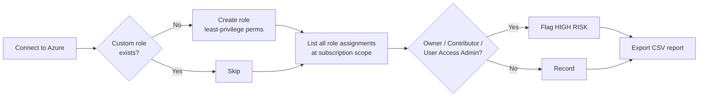

# Azure Least-Privilege RBAC: Custom Roles & Privileged Access Audit


**I replaced broad built-in Azure roles with two narrowly scoped custom RBAC roles, proved they enforce (4 allowed/denied tests against real test users), and remediated the standing `Owner` my own audit found by converting it to time-boxed PIM-eligible access.**

| | |
| :-- | :-- |
| **What I built** | A PowerShell script that deploys 2 least-privilege custom roles and audits all subscription role assignments |
| **What it found** | 1 standing `Owner` assignment at the subscription root (my own lab admin account), flagged as high risk |
| **What I did about it** | Built a break-glass account, made my Owner access PIM-eligible (365 days, 4h activations, MFA + justification), removed the standing grant, and reran the audit to prove the finding was gone |
| **How I proved the roles work** | 4 enforcement tests run as two non-admin test users: 2 allowed, 2 denied with `AuthorizationFailed` |
| **Skills shown** | Azure RBAC design, custom role authoring (`Actions` / `NotActions` / `DataActions`), PowerShell automation, privileged access auditing, KQL |

---

## Problem Statement

Built-in roles like **Owner** and **Contributor** are the easiest way to give people access, and they're the most dangerous. A Contributor can delete any resource in scope. An Owner can also grant access to anyone else. Most teams hand them out because building something narrower takes more work.

I wanted to answer two questions in my own Azure lab:
1. Can I give an engineer exactly the access a job needs (rotating Key Vault secrets or managing network security) without handing over the keys to the subscription?
2. Can I automatically find everyone who *already* holds dangerous standing access?

## Objective

- Author custom RBAC roles that follow the principle of least privilege (NIST SP 800-53 **AC-6**).
- Deploy them with repeatable PowerShell instead of clicking through the portal.
- Audit every role assignment at the subscription scope and flag high-risk roles.
- Write a detection query for new role assignments, which is a common privilege escalation path.

## Tools & Environment

| Category | Details |
| :-- | :-- |
| Cloud | Microsoft Azure (personal lab subscription), Microsoft Entra ID |
| Automation | PowerShell 7, Az PowerShell module (`Az.Accounts`, `Az.Resources`) |
| Monitoring | Azure Activity Log, Log Analytics / Microsoft Sentinel (KQL) |
| Frameworks | NIST SP 800-53 AC-6, MITRE ATT&CK T1098.003 |

---

## How It Works



### Custom Role Design

| Role | Can do | Explicitly carved out (`NotActions`) | Why it matters |
| :-- | :-- | :-- | :-- |
| **Custom Key Vault Secrets Officer** | Read vaults, read and write secrets, get/set secret values | Modify or delete the vault itself, write any authorization settings | Lets someone rotate secrets without being able to destroy the vault or change who has access |
| **Custom Network Security Admin** | Manage all `Microsoft.Network/*` resources (VNets, NSGs, firewalls) | ExpressRoute circuits, authorization writes | Lets someone run network security day to day without touching costly circuits or granting themselves more access |

Full definitions: [`roles/`](roles/)

> **Design note:** `NotActions` doesn't *deny* anything. It subtracts from what `Actions` grants. The `Microsoft.Authorization/*/write` carve-out is defense in depth: it guarantees a wildcard like `Microsoft.Network/*` can never be widened to include permission management. Real deny guarantees need Azure deny assignments or Azure Policy.

---

## Step-by-Step Breakdown

### 1. Wrote the custom role definitions
I started from the job each role supports and listed only the operations that job needs, using the [Azure resource provider operations reference](https://learn.microsoft.com/azure/role-based-access-control/resource-provider-operations). Key Vault secret *values* live in the data plane, so they needed `DataActions`, not `Actions`.

### 2. Automated deployment with PowerShell
[`scripts/deploy-rbac-least-privilege.ps1`](scripts/deploy-rbac-least-privilege.ps1) checks whether each role already exists, so re-running it is safe. It builds the role objects and creates them with `New-AzRoleDefinition`.

```powershell
# Preview: shows what would be created, and still runs the read-only audit
.\scripts\deploy-rbac-least-privilege.ps1 -SubscriptionId "<SUBSCRIPTION_ID>" -WhatIf

# Deploy
.\scripts\deploy-rbac-least-privilege.ps1 -SubscriptionId "<SUBSCRIPTION_ID>"

# Deploy with roles assignable only inside one resource group
.\scripts\deploy-rbac-least-privilege.ps1 -AssignableScope "/subscriptions/<SUBSCRIPTION_ID>/resourceGroups/RG-Data"
```

**Prerequisites:** Windows PowerShell 5.1 or PowerShell 7+, `Install-Module Az -Scope CurrentUser`, and **User Access Administrator** or **Owner** on the target scope.

### 3. Audited existing access
The script pulls every role assignment at the subscription scope with `Get-AzRoleAssignment`, flags high-risk roles, prints a summary, and exports a CSV to `output/`. That folder is git-ignored because live reports contain real identities.

### 4. Wrote a detection for new role assignments
[`queries/detect-rbac-role-assignment.kql`](queries/detect-rbac-role-assignment.kql) watches the Activity Log for successful `roleAssignments/write` operations. That's how an attacker with a foothold would grant themselves more access (MITRE **T1098.003**).

---

## Enforcement Testing

Creating a role proves the definition exists. These tests prove it **enforces**. Each one runs as a real non-admin test user holding only the custom role, and the runner records expected vs. actual.

| ID | Test | Role under test | Expected | Actual | Result |
| :-- | :-- | :-- | :-- | :-- | :-- |
| TC01 | Write a Key Vault secret version | Custom Key Vault Secrets Officer | Allowed | Allowed | **PASS** |
| TC02 | Delete the Key Vault | Custom Key Vault Secrets Officer | Denied | Denied (`AuthorizationFailed`) | **PASS** |
| TC03 | Grant self `Reader` on the resource group | Custom Network Security Admin | Denied | Denied (`AuthorizationFailed`) | **PASS** |
| TC06 | Create a Network Security Group | Custom Network Security Admin | Allowed | Allowed | **PASS** |

Evidence: [`evidence/enforcement-results-keyvault.csv`](evidence/enforcement-results-keyvault.csv), [`evidence/enforcement-results-network.csv`](evidence/enforcement-results-network.csv). Plan and run instructions: [`docs/verification-plan.md`](docs/verification-plan.md).

Three design choices in [`scripts/invoke-rbac-enforcement-tests.ps1`](scripts/invoke-rbac-enforcement-tests.ps1) that keep the results honest:

- **It refuses to run as an account holding Owner, Contributor, or User Access Administrator.** A denial test passed by an admin proves nothing.
- **It classifies outcomes as Allowed / Denied / Error, not pass/fail on exceptions.** Anything that isn't an authorization failure is an `Error` and is never scored as a denial. That is what surfaced finding T02 below.
- **If a test expected to be denied is unexpectedly allowed, it reverts the change** and marks the test FAIL.

---

## Remediating the Finding: Standing Owner to PIM-Eligible

The audit's whole point was the finding. Leaving it in place would make this a reporting exercise, so I fixed it.

**Order of operations, so a mistake can't lock me out:**

1. Created a **break-glass** account with permanent `Owner`, credentials stored offline.
2. Made my admin account **PIM-eligible** for `Owner` (365 days).
3. Set the Owner activation policy: **4-hour maximum**, Azure MFA, justification required.
4. Removed the **standing** `Owner` assignment. The script refuses this step unless a separate account still holds permanent Owner and the eligible assignment has verified.
5. Activated on demand and confirmed the role arrives with an expiry.

**Before and after, from the same audit script:**

| | Permanent Owners at subscription scope |
| :-- | :-- |
| Before ([`evidence/audit-before-pim.csv`](evidence/audit-before-pim.csv)) | lab admin (standing, ~6 days old) |
| After ([`evidence/audit-after-pim.csv`](evidence/audit-after-pim.csv)) | break-glass only |

The full directory trail, including both failures, is in [`evidence/pim-audit-trail.md`](evidence/pim-audit-trail.md): 13 PIM events, 56 minutes from first request to a working time-boxed activation.

> **Honest note:** the "after" audit still reports 1 high-risk assignment, because break-glass Owner *is* standing privilege. The script can't tell intent from mistake. A production version keeps an approved-exception list so expected accounts are reported separately from findings. That's the next change I'd make to the audit.

> **Second honest note:** activation **approval is off**. I turned it on, hit the lockout described in T03, and turned it back off because a one-person tenant has no second approver. In production, approval stays on with a named approver group.

---

## Troubleshooting Findings

Three problems worth more than the lab itself, each traced to root cause in the logs. Full write-ups: [`docs/troubleshooting.md`](docs/troubleshooting.md).

| ID | Symptom | Root cause | Lesson |
| :-- | :-- | :-- | :-- |
| **T01** | Test user signs in successfully, then "You don't have access to this." `AADSTS530035` | The tenant runs **security defaults**, which block the **device code flow** I used to keep sessions separate | Authentication succeeded and a tenant policy blocked the *method*. The sign-in log's "Original transfer method" field named it in one line. |
| **T02** | TC06 returned **Error**, not Denied: *"subscription is not registered to use namespace Microsoft.Network"* | The resource provider was never registered, and registering one is a subscription-level write the test user deliberately can't do | Separate "not allowed" from "not possible". Scoring that as a denial would have been a false pass for least privilege. |
| **T03** | PIM activation sat pending forever; the approver queue was empty | Approval was required with **no approver named**, so requests went to a fallback nobody could act on | Approval without a named approver is a lockout waiting to happen. The break-glass account fixed the policy in 5 minutes. |

---

## Visual Evidence

**Figure 1: Script deploying both custom roles.**


**Figure 2: Custom Key Vault Secrets Officer in the Azure portal.** Exactly 4 control-plane permissions, no vault write or delete.


---

## Final Results

- ✅ **2 custom RBAC roles** deployed through code and confirmed in the portal
- ✅ **4 of 4 enforcement tests pass** — both allowed operations work, both privilege-escalation and destructive operations are denied
- ✅ **Audit finding remediated**: standing `Owner` converted to PIM-eligible with 4-hour, MFA-gated activations; the same audit now reports it gone
- ✅ **Break-glass account** created and actually used to recover from a self-inflicted approval lockout
- ✅ **KQL detection** written for new role assignments (MITRE **T1098.003**)
- ✅ **3 root-caused findings** documented with the log evidence that identified each

---

## Lessons Learned

- **A role definition is a claim; a denial is proof.** The two `AuthorizationFailed` results are the only evidence that `NotActions` did anything.
- **`NotActions` subtracts, it doesn't deny.** Proving what a role *can't* do matters more than authoring it.
- **Control plane vs. data plane.** Key Vault secret values need `DataActions`, and those only apply when the vault uses the Azure RBAC permission model rather than legacy access policies. The setup script verifies the model instead of assuming it.
- **Removing your own standing access is safe only in the right order.** Break-glass first, eligibility verified second, removal last. My script enforces that order rather than trusting me to remember it.
- **Eligibility and activation are two different clocks.** *Eligible until* is how long you may ask (a year). *Activation duration* is how long you hold it (hours). PIM rejected my first request because I asked for permanent eligibility.
- **The failures are the evidence.** A rejected policy request, a blocked sign-in method, and an unreachable approver queue taught more than the parts that worked the first time.

## What I'd Improve Next

1. **Exception list in the audit** so approved break-glass accounts are reported separately from findings.
2. **PIM for the directory plane**: my account is still a permanent Global Administrator, and break-glass has no directory role. Same problem, other half of the tenant.
3. **Replace security defaults with scoped Conditional Access** (admin MFA, legacy-auth block, sign-in frequency), which also removes the device-code block from T01.
4. **Tighter scope**: redeploy the roles as assignable only at resource-group level.
5. **Infrastructure as code**: role definitions in Bicep, deployed through a pipeline.
6. **Sentinel rule**: deploy the KQL as a scheduled analytics rule and capture a triggered alert.

---

## Repository Structure

```text
AZURE-IAM/
├── README.md
├── scripts/
│   ├── deploy-rbac-least-privilege.ps1     # deploy roles + audit assignments
│   ├── setup-rbac-test-env.ps1             # RG, RBAC-mode Key Vault, RG-scoped test assignments
│   ├── invoke-rbac-enforcement-tests.ps1   # allowed/denied enforcement tests
│   ├── convert-owner-to-pim-eligible.ps1   # standing Owner -> PIM-eligible (break-glass guarded)
│   └── new-department-dynamic-groups.ps1   # dynamic department groups from user attributes
├── roles/                                  # custom role definitions (JSON)
├── queries/
│   └── detect-rbac-role-assignment.kql     # Sentinel / Log Analytics detection
├── docs/
│   ├── verification-plan.md                # enforcement test cases + how to run them
│   └── troubleshooting.md                  # T01, T02, T03 root-cause write-ups
├── evidence/                               # sanitized test results and audit before/after
├── reports/                                # sanitized sample audit output
└── screenshots/
```

*All subscription IDs, tenant IDs, UPNs, and IP addresses are redacted. Live audit output is written to a git-ignored `output/` folder.*

---

*Built by **Alex "Dae" Adewoyin**, Cybersecurity Analyst focused on Identity & Access Management.*
