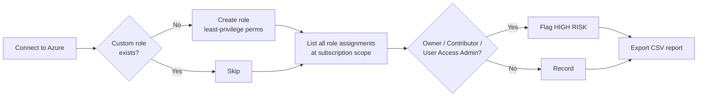
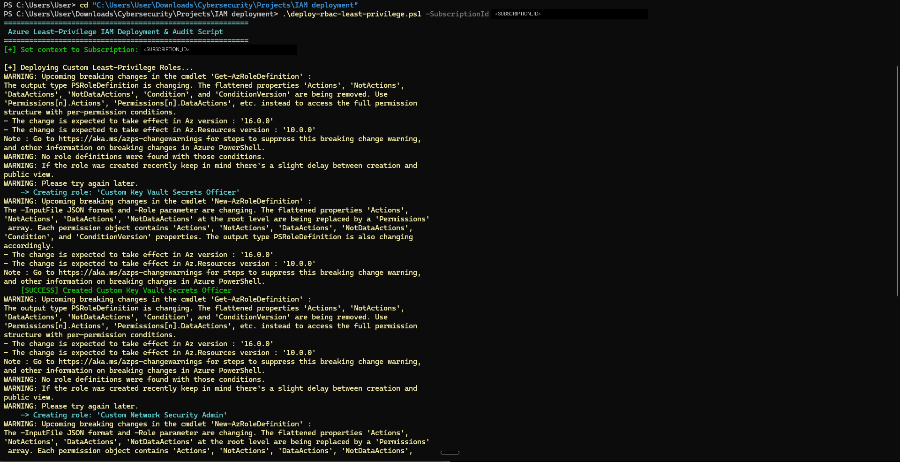
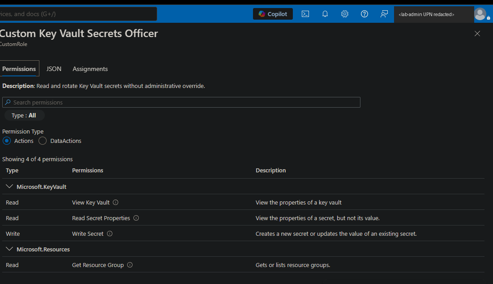

# Azure Least-Privilege RBAC: Custom Roles & Privileged Access Audit


**I replaced broad built-in Azure roles with two narrowly scoped custom RBAC roles and built a PowerShell audit that flags every Owner, Contributor, and User Access Administrator assignment in a subscription.**

| | |
| :-- | :-- |
| **What I built** | A PowerShell script that deploys 2 least-privilege custom roles and audits all subscription role assignments |
| **What it found** | 1 standing `Owner` assignment at the subscription root (my own lab admin account), flagged as high risk |
| **Skills shown** | Azure RBAC design, custom role authoring (`Actions` / `NotActions` / `DataActions`), PowerShell automation, privileged access auditing, KQL |

---

## Problem Statement

Built-in roles like **Owner** and **Contributor** are the easiest way to give people access, and they're the most dangerous. A Contributor can delete any resource in scope. An Owner can also grant access to anyone else. Most teams hand them out because building something narrower takes more work.

I wanted to answer two questions in my own Azure lab:
1. Can I give an engineer exactly the access a job needs (rotating Key Vault secrets or managing network security) without handing over the keys to the subscription?
2. Can I automatically find everyone who *already* holds dangerous standing access?

## Objective

- Author custom RBAC roles that follow the principle of least privilege (NIST SP 800-53 **AC-6**).
- Deploy them with repeatable PowerShell instead of clicking through the portal.
- Audit every role assignment at the subscription scope and flag high-risk roles.
- Write a detection query for new role assignments, which is a common privilege escalation path.

## Tools & Environment

| Category | Details |
| :-- | :-- |
| Cloud | Microsoft Azure (personal lab subscription), Microsoft Entra ID |
| Automation | PowerShell 7, Az PowerShell module (`Az.Accounts`, `Az.Resources`) |
| Monitoring | Azure Activity Log, Log Analytics / Microsoft Sentinel (KQL) |
| Frameworks | NIST SP 800-53 AC-6, MITRE ATT&CK T1098.003 |

---

## How It Works



### Custom Role Design

| Role | Can do | Explicitly carved out (`NotActions`) | Why it matters |
| :-- | :-- | :-- | :-- |
| **Custom Key Vault Secrets Officer** | Read vaults, read and write secrets, get/set secret values | Modify or delete the vault itself, write any authorization settings | Lets someone rotate secrets without being able to destroy the vault or change who has access |
| **Custom Network Security Admin** | Manage all `Microsoft.Network/*` resources (VNets, NSGs, firewalls) | ExpressRoute circuits, authorization writes | Lets someone run network security day to day without touching costly circuits or granting themselves more access |

Full definitions: [`roles/`](roles/)

> **Design note:** `NotActions` doesn't *deny* anything. It subtracts from what `Actions` grants. The `Microsoft.Authorization/*/write` carve-out is defense in depth: it guarantees a wildcard like `Microsoft.Network/*` can never be widened to include permission management. Real deny guarantees need Azure deny assignments or Azure Policy.

---

## Step-by-Step Breakdown

### 1. Wrote the custom role definitions
I started from the job each role supports and listed only the operations that job needs, using the [Azure resource provider operations reference](https://learn.microsoft.com/azure/role-based-access-control/resource-provider-operations). Key Vault secret *values* live in the data plane, so they needed `DataActions`, not `Actions`.

### 2. Automated deployment with PowerShell
[`scripts/deploy-rbac-least-privilege.ps1`](scripts/deploy-rbac-least-privilege.ps1) checks whether each role already exists, so re-running it is safe. It builds the role objects and creates them with `New-AzRoleDefinition`.

```powershell
# Preview: shows what would be created, and still runs the read-only audit
.\scripts\deploy-rbac-least-privilege.ps1 -SubscriptionId "<SUBSCRIPTION_ID>" -WhatIf

# Deploy
.\scripts\deploy-rbac-least-privilege.ps1 -SubscriptionId "<SUBSCRIPTION_ID>"

# Deploy with roles assignable only inside one resource group
.\scripts\deploy-rbac-least-privilege.ps1 -AssignableScope "/subscriptions/<SUBSCRIPTION_ID>/resourceGroups/RG-Data"
```

**Prerequisites:** Windows PowerShell 5.1 or PowerShell 7+, `Install-Module Az -Scope CurrentUser`, and **User Access Administrator** or **Owner** on the target scope.

### 3. Audited existing access
The script pulls every role assignment at the subscription scope with `Get-AzRoleAssignment`, flags high-risk roles, prints a summary, and exports a CSV to `output/`. That folder is git-ignored because live reports contain real identities.

### 4. Wrote a detection for new role assignments
[`queries/detect-rbac-role-assignment.kql`](queries/detect-rbac-role-assignment.kql) watches the Activity Log for successful `roleAssignments/write` operations. That's how an attacker with a foothold would grant themselves more access (MITRE **T1098.003**).

---

## Visual Evidence

**Figure 1: Script deploying both custom roles.** The Az module's upcoming-change warnings are now suppressed in the updated script.


**Figure 2: Custom Key Vault Secrets Officer in the Azure portal.** It has exactly 4 control-plane permissions and no vault write or delete.


---

## Final Results

- ✅ **2 custom RBAC roles** deployed through code and confirmed in the Azure portal
- ✅ **Audit ran against the subscription.** It flagged **1 of 1** assignments as high risk: a standing `Owner` on my own admin account ([sanitized sample](reports/audit-report-sample.csv))
- ✅ **KQL detection** written for new role assignments
- ⏳ **Enforcement tests** (allowed vs. denied actions) are planned in [`docs/verification-plan.md`](docs/verification-plan.md)

The audit finding is the point. Even in a one-person lab, the default setup left a permanent Owner at the subscription root, which is exactly the standing privilege PIM exists to remove.

---

## Lessons Learned

- **Custom roles are about subtraction.** The hard part isn't granting access. It's proving what a role *can't* do. That's why the verification plan matters more than the deployment.
- **Control plane vs. data plane.** Key Vault secret values need `DataActions`, and they only apply when the vault uses the Azure RBAC permission model, not legacy access policies.
- **`NotActions` isn't a deny.** Knowing this difference is what separates copying a role from designing one.
- **Az module changes are coming.** `PSRoleDefinition` is moving to a `Permissions[]` structure in Az 16. The script will need an update when that ships.

## What I'd Improve Next

1. **Run TC01 to TC03** with a test user and capture the `403 AuthorizationFailed` evidence.
2. **Remediate the finding:** convert the standing Owner assignment to a **PIM-eligible** assignment with approval and time limits.
3. **Tighten scope:** redeploy the roles as assignable only at the resource-group level.
4. **Deploy the KQL** as a scheduled Sentinel analytics rule and capture a triggered alert.
5. **Infrastructure as code:** rewrite the role definitions in Bicep.
6. **Wider audit:** include management-group scope and flag assignments to guest users and orphaned principals.

---

## Repository Structure

```text
AZURE-IAM/
├── README.md
├── scripts/
│   └── deploy-rbac-least-privilege.ps1   # deploy roles + audit assignments
├── roles/
│   ├── custom-keyvault-secrets-officer.json
│   └── custom-network-security-admin.json
├── queries/
│   └── detect-rbac-role-assignment.kql   # Sentinel / Log Analytics detection
├── reports/
│   └── audit-report-sample.csv           # sanitized audit output
├── docs/
│   └── verification-plan.md             # enforcement test cases
└── screenshots/
    ├── 01-script-role-deployment.png
    └── 02-custom-role-portal-permissions.png
```

---

*Built by **Alex "Dae" Adewoyin**, Cybersecurity Analyst focused on Identity & Access Management.
